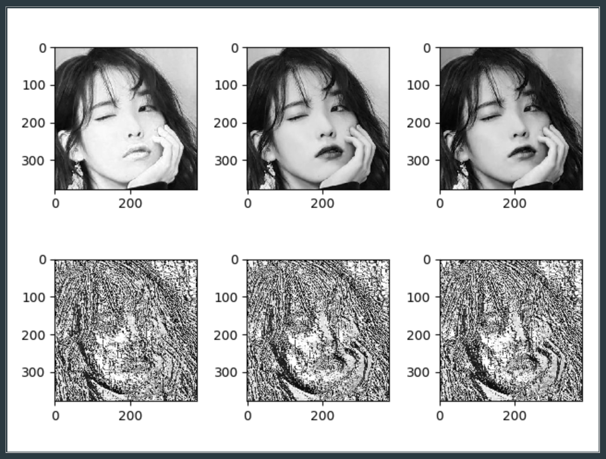
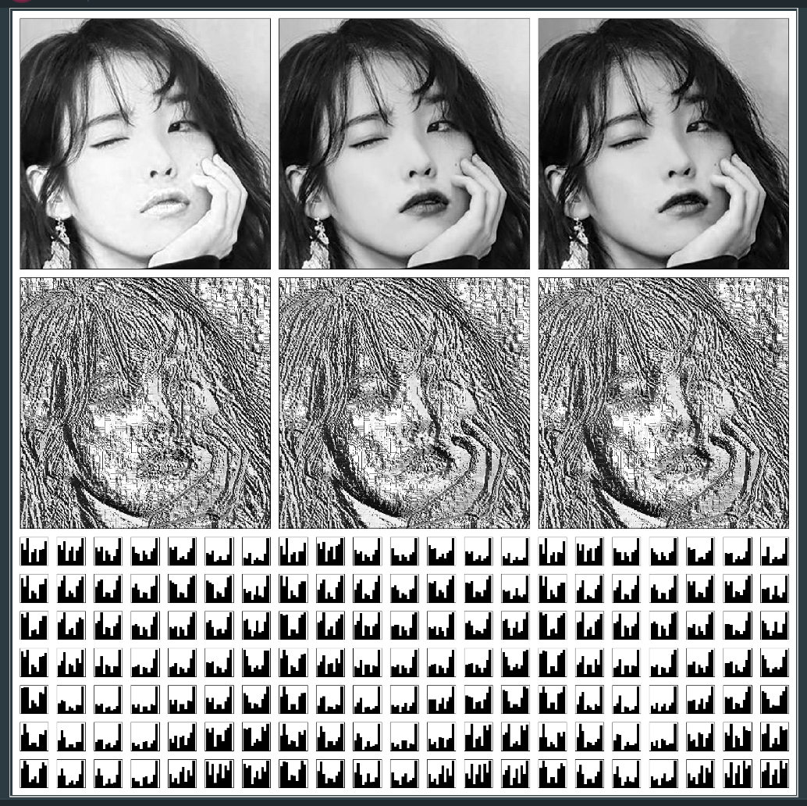

# Local Binary Patterns

Computer vision 분야의 Feature detection 방식 중 하나인 Local Binary Patterns

Face recognizernition 등에 사용된다.


## I. Concept

이미지를 3x3 pixel의 블록으로 쪼개어 블록의 중앙값을 기준으로 theresholding 하여 binary로 uint8로 변환하는 방식


## II. Implementation

* LBP Code

    ```python
    import matplotlib.pyplot as plt
    import numpy as np
    
    org_img = np.transpose(plt.imread('iu3.jpeg'), (2, 0, 1))
    r, c = org_img[0].shape
    # Image Import Part
    # RGB channel
    # org_img.shape = (3, r, c)
    
    pd_img = np.pad(org_img, ((0, 0), (1, 1), (1, 1)),\
                    'constant', constant_values=(0, 0))
    # Padding Part
    # pd_img.shape = (3, r+1, c+1)
    # for i in range(1, r):
    #	for j in range(1, c):
    #		pd_img[i][j] = org_img[i][j]
    
    lbp_img = np.zeros_like(org_img)
    # result.shape = (3, r, c)
    
    for i in range(3):
        ch_img = pd_img[i]
        # channal choice
        for j in range(r):
            for k in range(c):
                t = ch_img[j:j + 3, k:k + 3]
                # 3*3 array
                tt = t >= t[1, 1]
                # compare with center value
                lbp_img[i][j][k] = \
                    np.packbits((tt[1, 0], tt[2, 0], tt[2, 1], tt[2, 2],\
                                 tt[1, 2], tt[0, 2], tt[0, 1], tt[0, 0]))[0]
                # Boolean Array 2 Unsigned Int8
                # Into result image
                
    for i in range(3):
        plt.subplot(2, 3, i + 1)
        plt.imshow(org_img[i], cmap=plt.get_cmap('gray'))
        plt.subplot(2, 3, 3 + i + 1)
        plt.imshow(lbp_img[i], cmap=plt.get_cmap('gray'))
    plt.show()
    # Output Part
    ```


* Block histogram

  1/4 사이즈를 갖는 블록 구간을 나누어 히스토그램을 출력하였다.

  ```python
  tr, tc = r // 8, c // 8
  plt.figure(figsize=(20, 20))
  for i in range(3):
      for j in range(7):
          for k in range(7):
              plt.subplot2grid((21, 21), (14 + j, 7 * i + k))
              plt.hist(lbp_img[i, j * tr:(j + 2) * tr, k * tc:(k + 2) * tc],\
                       density=1, histtype='stepfilled', facecolor='k')
              plt.xticks([])
              plt.yticks([])
  ```

## III. Result

* Input Image

  


* Output plot

    


* Histogram

  